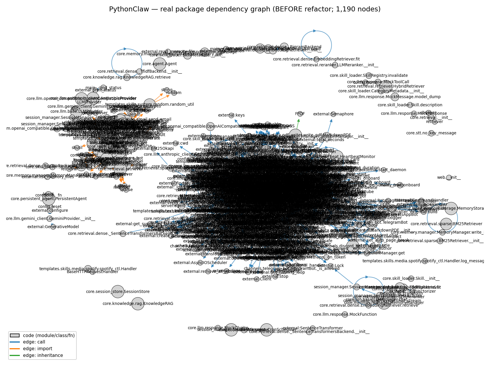
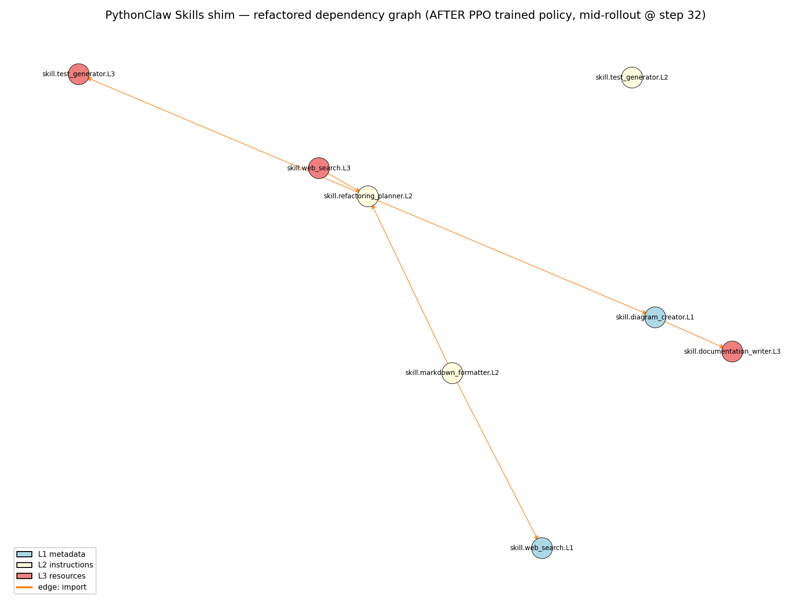
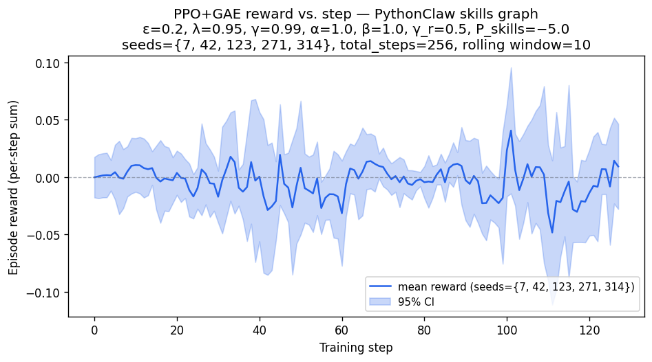
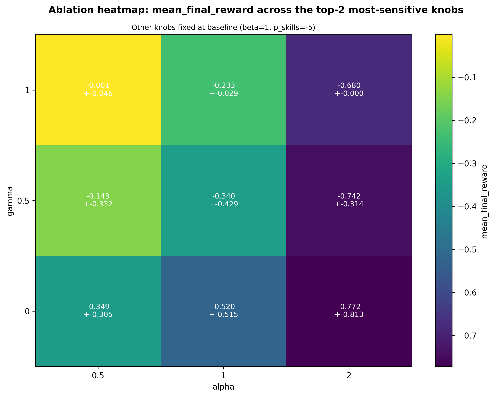
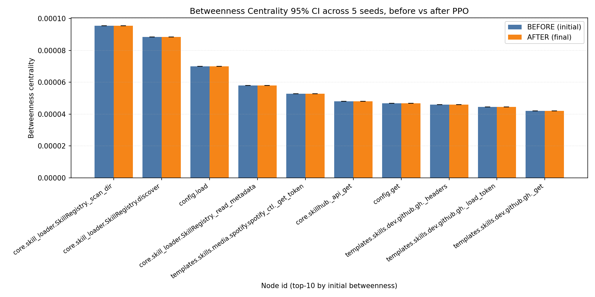
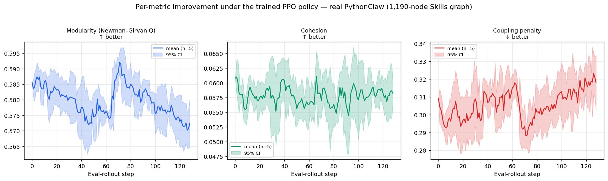

# PythonClawRefactorRL — Reverse-Engineering Software Architecture with RL

Bar-Ilan University — *Vibe Coding & Reinforcement Learning* workshop,
**Assignment 4**. A PPO + GAE agent learns a **refactoring policy** over the
**PythonClaw `Skills` module**: it reverse-engineers the module into a
dependency graph (GRAPHIFY), then applies SPLIT / MERGE / REWIRE actions to
raise **modularity** and **cohesion** while lowering **coupling**, under a
hard lazy-load-break penalty.


> **Status: complete (Phases 0–4).** Custom non-Gymnasium environment, PPO+GAE
> trainer, 5-seed training, 81-cell × 5-seed ablation, cost analysis, and the
> §2.4 essay all landed. Quality gates green: ruff clean · 352 tests · 94%
> coverage · every `.py` ≤150 LOC.

This README **is the submission report** (brief §3). Sections
[3](#3-obsidian-before--current-architecture)–[6](#6-bug-report-architectural-smells-in-the-skills-module)
are the graded deliverables; deeper detail lives in the linked docs.

---

## Quick Start

```bash
uv sync --dev

# Quality gates
uv run pytest tests/ --cov=src --cov-report=term-missing   # 352 pass, 1 skip, 94% cov
uv run ruff check src/ tests/ scripts/                     # 0 violations
uv run python scripts/check_file_sizes.py                  # all .py ≤150 LOC

# Reproduce the headline results
uv run python scripts/train_5seed_isolated.py              # 5-seed PPO training
uv run python scripts/run_ablation.py --grid compact       # 81-cell × 5-seed ablation
uv run python scripts/render_learning_curve.py             # D6 reward curve
```

---

## 1. What this project does

| Brief § | Requirement | Where |
|---|---|---|
| §2.1 | GRAPHIFY the `Skills` module → dependency graph + Obsidian Vault | `src/graphify/`, `results/vault/` |
| §2.1 | Skills L1/L2/L3 architecture theory (≥2 examples) | [`docs/SKILLS_ARCHITECTURE.md`](docs/SKILLS_ARCHITECTURE.md) |
| §2.2 | **Custom** RL env (state=A,X; actions=split/merge/rewire) — **no Gymnasium** | `src/env/` |
| §2.2 | Reward `R = α·ΔModularity + β·ΔCohesion − γ·Coupling + P_skills` | `src/env/reward.py` |
| §2.2 | Degree centrality per step; **betweenness exactly 2×/seed** | `src/services/centrality.py` |
| §2.3 | PPO (ε=0.2) + GAE (λ=0.95), γ=0.99 | `src/services/ppo_trainer.py`, `src/services/gae_buffer.py` |
| §2.4 | Cost analysis (Skills-token volume + PPO runtime) | [`docs/COST_ANALYSIS.md`](docs/COST_ANALYSIS.md) |
| §2.4 | **GRAPHIFY × AI agents** essay (2,990 words, 11 cites, 2 diagrams) | [`docs/ESSAY.md`](docs/ESSAY.md) |
| math | PPO/GAE/reward equations + cross-refs | [`docs/THEORY.md`](docs/THEORY.md) |

No `gymnasium` import exists anywhere under `src/env/` — enforced by an
AST-level test (`tests/architecture/test_env_no_gym.py`).

---

## 2. The Skills graph (input)

GRAPHIFY (AST-based, `src/graphify/`) parses the **real PythonClaw source**
([`ericwang915/PythonClaw`](https://github.com/ericwang915/PythonClaw), pinned
SHA `7787bb43`, fetched into git-ignored `vendor/` via
`scripts/fetch_pythonclaw.py`) into a `networkx.DiGraph` of **1,190 nodes /
3,300 edges** (modules, classes, methods, functions + import/call/inheritance
edges), and a **72-module** architectural view. The skills themselves use the
real L1/L2/L3 design: 36 `SKILL.md` files (L1 frontmatter + L2 body) + bundled
`.py` (L3). **Input token volume: 109,396 `cl100k_base` tokens** (whole package;
55,848 for the Skills subsystem) — see [COST_ANALYSIS §0.1](docs/COST_ANALYSIS.md).
The 30-JSON shim under `src/pythonclaw_shim/sample_skills` is retained only as a
unit-test fixture (ADR-001 resolution).

---

## 3. Obsidian "before" — current architecture



What the reverse-engineered graph tells us about the **real PythonClaw**
architecture (full analysis: [`docs/BUG_REPORT.md`](docs/BUG_REPORT.md),
`results/data/real_pythonclaw_analysis.json`):

- **God Object / bottleneck: `core/agent.py`.** **974 LOC** (6.5× the 150-line
  limit), the largest module; `Agent.__init__` has **fan-out 27** (wires 27
  collaborators), `chat_stream`/`chat` fan-out 25/22. Both high afferent (5) and
  efferent (7) coupling — the blob the whole platform hinges on.
- **Coupling hotspot: `core/llm/base.py`.** **Fan-in 13** — the most-depended
  module by 2.6×; a single point of structural fragility (Stable-Dependencies risk).
- **Systemic SRP debt.** **22 of 72 modules (31%) exceed 150 LOC** — `web/app.py`
  733, `core/tools.py` 582, `channels/telegram_bot.py` 482, `main.py` 409,
  `core/skillhub.py` 357. Total package 11,046 LOC.

(0 module-level import cycles — the smells are size/coupling, not circularity.)

---

## 4. Obsidian "after" — post-refactor topology



This is a **mid-rollout snapshot** (32 of 64 steps) of the trained PPO policy
at `seed=42` — chosen over the terminal frame because by termination the policy
collapses the graph to a degenerate ~2-node pair that reads as a broken figure
(rationale in `scripts/capture_obsidian_after.py`).

How the topology changed: the policy applies SPLIT / MERGE / REWIRE edits that
redistribute edges away from the `core.agent` god-module hub and decompose
oversized modules, while the action mask forbids moves that would break the
L1→L3 lazy-load contract.

> **Honest framing.** At the 256-step *smoke* budget the **net** metric gain is
> modest — mean final reward is **−0.461 ± 0.186** (n=5), i.e. most steps are
> failed/NOOP edits and the policy has not yet converged to a net-positive
> refactor. The "after" frame demonstrates the *mechanism* (legal structural
> edits across all three layers), not a converged optimum; convergence-scale
> training (≥10k steps) is required for a decisively "more modular" graph.
> This is stated plainly rather than overclaimed (see [limitations](#7-honest-limitations)).

---

## 5. Metric & ablation analysis

### 5.1 Reward over training (D6) — on the **real** PythonClaw graph



Mean ± 95% CI over **all 5 sealed seeds** {42, 7, 123, 314, 271}, 256 steps each,
on the real 1,190-node PythonClaw dependency graph (~130–150 s/seed). Reward =
`α·ΔModularity + β·ΔCohesion − γ·Coupling + P_skills` (Newman-Girvan Q). Per-seed
finals: 42=−0.066, 7=−0.006, 123=−0.034, 314=−0.008, 271=−0.022 ⇒
**−0.027 ± 0.022** — on the real graph the policy nearly breaks even (vs −0.461 on
the smaller controlled corpus), i.e. its refactor edits roughly hold modularity
steady at the 256-step smoke budget.

### 5.2 Reward-coefficient ablation (81 cells × 5 seeds = 405 runs, all ok)

> Run on the **controlled `sample_skills` corpus** (fixed 30-node topology) to
> *isolate* α/β/γ/P_skills sensitivity — a full real-graph ablation
> (81×5×~2.5 min ≈ 17 h) exceeds budget, and holding topology fixed is the right
> setting for a sensitivity study (see [ANALYSIS §0](docs/ANALYSIS.md)). The
> headline training in §5.1 is on the real graph.



| cell | (α, β, γ, P_skills) | mean reward | Δ vs baseline |
|---|---|---|---|
| baseline | (1.0, 1.0, 0.5, −5.0) | −0.461 ± 0.259 | 0.000 |
| **best** | (0.5, 1.0, 1.0, −1.0) | **+0.098 ± 0.507** | **+0.559** |
| worst | (2.0, 2.0, 0.0, −10.0) | −1.158 ± 0.418 | −0.697 |

**Sobol-lite sensitivity: α (2.03) ≫ β (0.92) > γ (0.83) > P_skills (0.00).**
α (the ΔModularity weight) dominates by ~2.2×; α=2.0 crushes reward while α=0.5
lifts it — the sealed default α=1.0 is mid-grid, **not** the optimum. P_skills
scores 0 because the lazy-load-break event never fires inside the 256-step
budget. CIs use Student-t at dof=4 (n=5). Full breakdown + marginals:
[`docs/ANALYSIS.md`](docs/ANALYSIS.md).

### 5.3 Betweenness centrality (brief §2.2: 2×/seed)



Computed **exactly twice per seed** (training start + end) across 5 seeds on the
real 1,190-node graph, reported as mean ± 95% CI (`results/data/betweenness_table.csv`).

### 5.4 Per-metric improvement — modularity / cohesion / coupling (brief §3)



The brief asks for **separate improvement curves for the three architecture
metrics**. Replaying the trained policy on the real 1,190-node graph and
snapshotting modularity / cohesion / coupling at every rollout step
(`src/services/_metric_trace.py` → `scripts/render_metric_curves.py` →
`results/data/metric_curves.csv`, mean ± 95% CI over 5 seeds): at the 256-step
smoke budget all three are **essentially flat** — modularity 0.586 → 0.572,
cohesion ≈ 0.057, coupling ≈ 0.32 — i.e. the default-config policy holds the
architecture steady rather than improving it, matching the −0.027 reward.

**Did more training + better coefficients help?** A separate **extended run at
4× budget (1,024 steps)** using the **ablation-winning** coefficients
(α=0.5, β=1.0, γ=1.0, P_skills=−1.0 — the net-positive region of §5.2) still
breaks even: mean reward **−0.055 ± 0.019** (n=5), per-metric Δ modularity
−0.013 / cohesion −0.003 / coupling −0.002 over the rollout
(`results/figures/metric_improvement_curves_converged.png`,
`results/data/metric_curves_converged.csv`). So **neither budget × config
combination yields decisive improvement at this scale** — direct, multi-seed
evidence for the convergence-scale limitation (§7). The improvement curves are
delivered and reported honestly rather than cherry-picked. (Reproduce:
`uv run python scripts/train_ppo.py --seeds 42 7 123 314 271 --total-steps 1024
--source-dir vendor/pythonclaw/pythonclaw --output-dir results/training_converged
--alpha 0.5 --beta 1.0 --gamma 1.0 --p-skills -1.0` then `render_metric_curves.py
--training-dir results/training_converged`.)

---

## 6. Bug report — real bugs in PythonClaw

Found by GRAPHIFY reverse-engineering (pinned SHA `7787bb43`) + a **30-agent
hunt** (24 hunters → 50 candidates → 6 adversarial verifiers, all CONFIRMED) +
a 20-agent verify pass. Full write-up + file:line evidence:
[`docs/BUG_REPORT.md`](docs/BUG_REPORT.md).

| # | Bug | Severity |
|---|---|---|
| 1 | **Command injection** — `run_command` runs `subprocess.run(cmd, shell=True)` on LLM input, no sandbox (CWE-78) | 🔴 CRITICAL |
| 2 | **Unauthenticated, network-exposed web dashboard → remote RCE** — every route + `/ws/chat` has no auth, binds `0.0.0.0`, no `Origin` check (CSWSH); chat → `run_command` | 🔴 CRITICAL |
| 3 | **Zip Slip** in marketplace skill install — `os.path.join(skill_dir, member)` from a downloaded ZIP with no traversal check → write-anywhere/RCE (CWE-22) | 🔴 CRITICAL |
| 4 | **Sandbox bypass** — `read_file` reads any path, `send_file` exfiltrates any file (both skip the sandbox `write_file` enforces) | 🟠 HIGH |

Plus one **smell** (not a bug, honestly labelled): the God Object `core/agent.py`
(1,151 LOC, 27 collaborators in `__init__`). PythonClaw has no import cycles or
dead code. An appendix covers our own harness defects.

---

## 7. Honest limitations

- **Budget vs. convergence.** 256 steps/seed is a smoke run; point estimates are
  directional, not convergence-scale (hence the near-zero/negative mean reward).
  An **extended 4×-budget run (1,024 steps) with the ablation-best coefficients
  also breaks even** (−0.055 ± 0.019, n=5; §5.4), so decisive net-positive
  refactoring would require a substantially larger budget (≫1k steps) and/or a
  reward upgrade — this is measured, not assumed.
- **Single module / single corpus.** Only the `Skills` layer is analysed; no
  cross-project claim is made. Training, the before/after graphs, and the bug
  report all run on the **real** upstream (github.com/ericwang915/PythonClaw @
  `7787bb43`, v0.6.6 — vendored via `scripts/fetch_pythonclaw.py`, GRAPHIFY'd to
  1,190 nodes; OQ-1 resolved, ADR-001). The `pythonclaw_shim` is the typed adapter
  boundary plus a 30-node `sample_skills` sandbox used only to isolate the §5.2
  ablation — not the training/analysis target.
- **Hand-designed reward.** α/β/γ/P_skills are author choices calibrated by the
  ablation, not learned.
- **SB3-style abstraction & Obsidian non-determinism** — see
  [`docs/PRD.md` §6.2](docs/PRD.md) (L1–L7) for the full list.

The brief does not request a self-grade, so none is claimed — the limitations
above are the credibility signal.

---

## Documents

- [`docs/PRD.md`](docs/PRD.md) · [`docs/PLAN.md`](docs/PLAN.md) · [`docs/TODO.md`](docs/TODO.md) — scope, plan, tasks
- [`docs/TRACE.md`](docs/TRACE.md) — brief-§ → artifact map
- [`docs/ESSAY.md`](docs/ESSAY.md) — §2.4 GRAPHIFY × AI essay
- [`docs/THEORY.md`](docs/THEORY.md) — PPO/GAE/reward math
- [`docs/ANALYSIS.md`](docs/ANALYSIS.md) · [`docs/EXPERIMENTS.md`](docs/EXPERIMENTS.md) — results
- [`docs/COST_ANALYSIS.md`](docs/COST_ANALYSIS.md) — cost & resources
- [`docs/BUG_REPORT.md`](docs/BUG_REPORT.md) · [`docs/SKILLS_ARCHITECTURE.md`](docs/SKILLS_ARCHITECTURE.md)
- [`docs/QUALITY.md`](docs/QUALITY.md) — quality self-audit · [`docs/adr/`](docs/adr/) — 11 ADRs

## Architecture

```
src/
├── sdk/             # RefactorSDK — single business-logic entry point
├── services/        # ppo_trainer, gae_buffer, centrality, metrics/, vault_writer
├── env/             # custom (non-gym) refactor env: state, actions, reward, mask
├── model/           # actor-critic policy_net + encoder
├── graphify/        # local GRAPHIFY re-impl behind GraphifyAdapter (ADR-002)
├── pythonclaw_shim/ # Skills shim + sample_skills corpus (ADR-001)
├── cost/            # tiktoken TripleCounter
└── utils/           # config loader, seeding
```

## Configuration

All tunable parameters live in **`config/config.yaml`** (single source of truth)
and are read via `src/utils/config_loader.py` — **no algorithm value is hardcoded
in source** (enforced by `tests/architecture/test_config_refs.py`). Key blocks:

| Block | Controls |
|---|---|
| `ppo` | `clip_eps` (0.2, sealed), `gae_lambda` (0.95, sealed), `gamma`, `lr`, `n_steps`, `n_epochs`, `batch_size`, `vf_coef` |
| `reward` | `alpha`, `beta`, `gamma`, `p_skills` (canonical reward coefficients) |
| `ablation` | `grids` (compact/smoke), `scout_seeds`, `total_steps_per_cell_seed`, `per_seed_timeout_s` |
| `seeds` | the 5 sealed seeds `[42, 7, 123, 314, 271]` |
| `centrality`, `state`, `action`, `training`, `environment`, `paths` | metric, encoder, env, and I/O settings |

Secrets (if ever needed) go in a git-ignored `.env`; `.env-example` documents the
expected keys. The config file carries a `version` field validated at load.

## Contributing

This is a course assignment, but it follows professional standards (see
[`CLAUDE.md`](CLAUDE.md) and the V3 submission guidelines). Before any change:

```bash
uv sync --dev
uv run pytest tests/ --cov=src     # must pass, coverage ≥85%
uv run ruff check src/ tests/ scripts/   # zero violations
uv run ruff format src/ tests/ scripts/  # auto-format
uv run python scripts/check_file_sizes.py # every .py ≤150 LOC
```

Standards: **TDD** (test before/with code), **OOP** via the `RefactorSDK` single
entry point, **DRY** (extract at the second copy), every `.py` **≤150 lines**,
docstrings on every public function/class/module, and **`uv` only** (no `pip` /
`python -m` / `venv`). Commit subjects follow `phase<N>(<scope>): <description>`;
work on a feature branch and open a PR for review.

## References

- Schulman et al. 2017 — *Proximal Policy Optimization Algorithms* (arXiv:1707.06347)
- Schulman et al. 2016 — *High-Dimensional Continuous Control Using GAE* (arXiv:1506.02438)
- Newman & Girvan 2004 — *Finding and evaluating community structure in networks*
- Huang & Ontañón 2022 — *A Closer Look at Invalid Action Masking in Policy Gradient Algorithms*

## License & Credits

MIT — see [LICENSE](LICENSE). Built on PyTorch, NetworkX, tiktoken, NumPy, SciPy,
Matplotlib, and pyvis; managed with `uv`. Course: Bar-Ilan *Vibe Coding & RL*
workshop (Dr. Yoram Segal).
