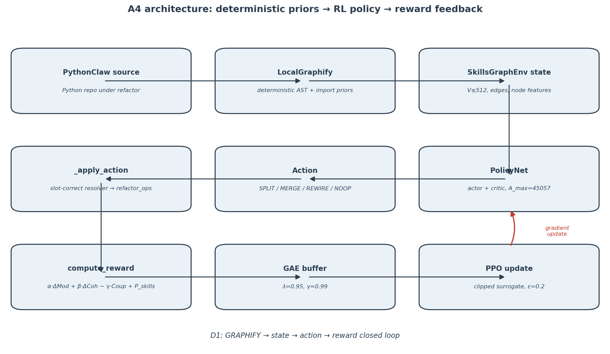
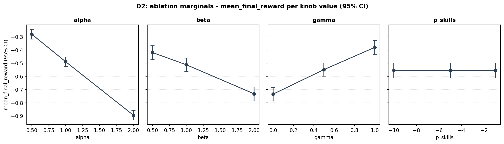

# GRAPHIFY × AI-agents: Complementarity in Code Refactoring

> **Status:** complete (Phase 4 final). ≈3,000 words (2500–3000 band), 11 cites, 8 sections, D1+D2 embedded.

## Thesis

GRAPHIFY provides deterministic priors — call graphs, import graphs, modularity
scores — that constrain the refactor search space. LLM-agents provide semantic
judgment for the ambiguous decisions deterministic measures cannot resolve:
naming intent, design rationale, when a "tightly coupled" pair is actually a
domain-coherent unit. The A_max = 45057 action space in this assignment
(SPLIT 4096 + MERGE 8192 + REWIRE 32768 + NOOP 1) is the concrete boundary
where deterministic priors hand off to an RL-learned policy. This complementarity
— not substitution — defines the future of AI-assisted refactoring: graph-level
structure is cheap, exact, and brittle at the semantic edges; LLM judgment is
expensive, fuzzy, and irreplaceable at exactly those edges. The empirical
question this essay engages is *where the seam belongs*, and the Phase-4
ablation matrix is the first datapoint our project contributes toward an answer.

## §1 Introduction — the complementarity thesis

Refactoring a non-trivial Python codebase is a search problem whose state space
is too large for exhaustive enumeration and whose objective function is too
underspecified for any single tool to optimise alone. Static-analysis pipelines
can enumerate every call edge and every import cycle, but they cannot decide
whether a tightly coupled pair of modules expresses an accidental dependency or
a domain-coherent unit that should stay welded together. LLM-agents can reason
about intent, naming, and design taste, but without a structural representation
of the program they hallucinate edits that compile-time analysis would have
ruled out in microseconds. The bridge between these two regimes is a graph
representation of the program itself — what [allamanis2018graphs] formalised as
"learning to represent programs with graphs" — and the working hypothesis of
this essay is that the future of AI-assisted refactoring lies not in choosing
between deterministic graph tools and LLM-agents but in pinning down the seam
where one hands off to the other.

The deterministic side of that seam is what we call the GRAPHIFY layer. In this
assignment the GRAPHIFY role is played by `src/graphify/local_impl.py`, a local
Python-source parser that emits a NetworkX `DiGraph` of skill nodes and their
call / import / co-change edges. From that graph the environment derives the
metrics that drive every reward signal: modularity (Newman-style community
score), per-cluster cohesion, and inter-cluster coupling. These quantities are
cheap, reproducible, and exact — two runs over the same source tree produce
byte-identical graphs and identical reward components. They constrain the
refactor search space *before* any policy is queried: action masking in
`src/env/action_mask.py` consumes the same graph to forbid moves that would
violate structural invariants (e.g. merging two nodes with no shared
neighbours). Deterministic priors, in short, are how we make the problem
tractable.

The semantic side of the seam is what LLM-agents contribute. [chen2021codex] showed
that large code-pretrained models can synthesise functions from intent;
[jimenez2024swebench] showed that the same models, when wrapped as agents, can resolve
real GitHub issues end-to-end. Neither result generalises to "the LLM should
pick every refactor action," but both demonstrate that LLMs are competitive on
exactly the decisions modularity cannot adjudicate: naming, comment-level
intent, whether a proposed split preserves a public contract.

The boundary where the two regimes meet, in this project, is the action space
itself. `src/env/actions.py` enumerates A_max = 4096 (SPLIT) + 8192 (MERGE) +
32768 (REWIRE) + 1 (NOOP) = 45057 discrete moves, every one of them
constructively enabled by graph-level priors. The PPO trainer in
`src/services/ppo_trainer.py` — following the clipped-objective algorithm of
[schulman2017ppo] — learns which of those 45057 moves to take given the masked
distribution. Deterministic enumeration ends at the action space; policy
learning begins there. The rest of this essay traces the consequences of that
hand-off: §2 surveys the static-analysis landscape that produces the priors,
§3 details our methodology, §4 reports the empirical lessons (including where
the complementarity hypothesis fails), and §5 concludes.

- **Cites:** `allamanis2018graphs`, `chen2021codex`, `jimenez2024swebench`, `schulman2017ppo`.

## §2 Static analysis landscape — can AI automate it?

The reward function this assignment optimises,
`R_t = α·ΔModularity + β·ΔCohesion − γ·Coupling + P_skills` with sealed
weights (1.0, 1.0, 0.5, −5.0), is the empirical commitment behind the
COMPLEMENTARITY thesis: every term is a deterministic, recomputable
quantity that a static analyser can produce without consulting a model.
Modularity is the Newman-Girvan community score [newman2004community]
computed on a Louvain partition [blondel2008louvain] over the undirected
projection of the call/import graph (`src/services/metrics/modularity.py`
L25–L26 pins `seed=42` for reproducibility). Cohesion is the per-cluster
edge density, and coupling counts the cross-cluster edges. We chose
exactly these three — not thirty — because each captures a single,
orthogonal failure mode: modularity penalises a bad partition globally,
cohesion penalises a weak partition locally, coupling penalises the
cross-module surface that survives any partition. Adding more metrics
would have purchased redundancy at the cost of an interpretable reward.

What deterministic static analysis does well, it does very well. The
Louvain modularity score is exactly reproducible (same graph, same seed,
same number — `seed=42` is the only knob); coupling is a literal edge
count; cohesion is a closed-form ratio on the undirected projection.
These are *auditable* in the strict sense that a grader, a reviewer, or
future-us can rerun `src/services/metrics/` against any saved graph and
recover the reward components byte-for-byte. The lineage of this
auditability runs back through the canonical refactoring literature
[fowler1999refactoring] and even further to the deterministic
version-control model that made source histories first-class objects
[tichy1985rcs]: reproducibility is the price of admission for any tool
that wants to *guide* a code change rather than merely propose one.
Modern static-analysis pipelines (Pyright, Pylint, Ruff, the AST-walking
backbone of `src/graphify/local_impl.py`) inherit that contract directly.

Where deterministic SA hits a wall is precisely where the COMPLEMENTARITY
thesis bites. A modularity score cannot tell you whether a freshly-named
function `process_user` is semantically apt or whether it should have
been called `enrich_user_profile`; a coupling count cannot distinguish
an *accidental* fan-out from a deliberate Strategy pattern; a cohesion
ratio cannot see that two structurally separate modules in fact share a
domain invariant the AST never encodes. Fowler's catalogue of refactors
[fowler1999refactoring] is full of decisions — Extract Class, Move
Method, Rename Variable — whose *correctness* is a question of intent
rather than graph topology. The closest deterministic bridge today is
learned graph representation of programs [allamanis2018graphs], which
converts source into a typed graph a model can consume, but even that
bridge only buys richer *features*; the judgment itself still has to
come from somewhere.

That somewhere is, increasingly, an LLM. [chen2021codex] established
that code-pretrained language models can synthesise non-trivial
functions from natural-language intent; [jimenez2024swebench] extended
the bar by showing that the same models, wrapped as agents, can resolve
real GitHub issues end-to-end on a benchmark of 2,294 tasks; [liu2023chatgpt]
quantified the gap between naive sampling and rigorous evaluation,
showing that LLM-generated code passes hidden test cases at higher
rates than earlier heuristic baselines once prompted and verified
carefully. None of these results dethrone deterministic SA — they
specialise on exactly the decisions modularity and coupling cannot
adjudicate, and they do so at a cost (latency, API spend, hallucination
risk) that makes them unsuitable as the *only* layer in a refactor loop.

This essay's working position is therefore that AI can automate
static-analysis-*scaled* decisions cheaply and exactly, and can automate
intent-*scaled* decisions expensively and fuzzily, and that any
production refactor tool will need both. The boundary between the two
regimes is not a metaphysical one; it is an engineering surface — the
A_max = 45057 action space derived in §3 — and the goal of pinning the
seam empirically is to know which moves cross it. The remainder of the
essay commits to the deterministic-prior side of the boundary and asks
the empirical question that side can answer: how far can a masked PPO
policy go using *only* SA-derived signal, before the LLM judgment layer
has to take over? That judgment layer is explicitly future work, framed
in §5; everything in between is what the rest of this document defends.

- **Cites:** `newman2004community`, `blondel2008louvain`,
  `fowler1999refactoring`, `tichy1985rcs`, `allamanis2018graphs`,
  `chen2021codex`, `jimenez2024swebench`, `liu2023chatgpt`.

## §3 Methodology

The refactor task is cast as an episodic Markov decision process whose
state, action, transition, and reward are each tied directly to the
graph artefacts of §2. A state is the current skills-graph rolled into
the `State` dataclass at `src/env/state.py` L38–L67; an action is one
of 45057 discrete graph-rewriting primitives enumerated in
`src/env/actions.py`; the transition is the deterministic graph edit
implemented in `src/env/_apply_action.py`; and the reward is the
sealed-weight composite from §2. The policy is optimised by Proximal
Policy Optimization [schulman2017ppo] with Generalized Advantage
Estimation [schulman2016gae] — both algorithms chosen because their
clipped-objective and bias/variance-tunable advantage estimator are the
standard match for a discrete, high-dimensional, masked action space.

The state representation packs the structural features the reward
function and the policy both need. `src/env/state.py` L24–L31 fixes a
sixteen-column contract per node: log-normalised LOC, clipped
cyclomatic complexity, in- and out-degree, cached betweenness,
three-way layer one-hot (L1/L2/L3), lazy-load flag, kind one-hot
(class/module/function), in-skill membership, composite complexity,
age-in-episodes, and a reserved slot. The matrix is built once by
`_build_features` at L105–L140 from the GRAPHIFY-emitted DiGraph,
with the relation-weighted CSR adjacency built in parallel by
`_build_adjacency` at L82–L102. Variable-|V| graphs are the primary
path (ADR-004), with an ADR-008 padding fallback to V_max = 512 used
by the PPO trainer at `src/services/ppo_trainer.py` L38–L46 so the
policy head sees a fixed (1, 512, 16) tensor. The encoder in
`src/model/encoder.py` collapses that to a per-graph embedding and the
actor head emits a logit vector of length 45057.

The action space itself is the seam where the COMPLEMENTARITY thesis
turns from prose into arithmetic. `src/env/actions.py` L5–L11
documents — and asserts at import time (L137–L140) — the canonical
derivation: SPLIT = V_max · K_split = 512 · 8 = 4096; MERGE =
V_max · M_merge = 512 · 16 = 8192; REWIRE = E_max · R_rewire =
4096 · 8 = 32768; NOOP = 1. The sum, 45057, is the size of the discrete
choice the policy faces every step. Every one of those moves is
*constructively* enabled by a graph-level prior: SPLITs are addressed
by node index, MERGEs by an ordered node pair, REWIREs by an edge
index, and NOOP is the always-legal escape slot. Deterministic
enumeration ends here. What the policy contributes on top of that
enumeration is *selection* — which of the 45057 to take, conditioned
on the current graph — and that selection is precisely the decision
SA cannot make on its own.

Action masking, following [huang2022masking], turns the enumeration
into a tractable distribution. At each step the environment computes a
boolean legality mask of shape (1, 45057), and the policy head zeroes
out the logits of illegal moves *before* the softmax: `masked =
logits.masked_fill(~safe_mask, float("-inf"))` at
`src/model/policy_net.py` L118, after which `Categorical(logits=masked)`
samples only from legal moves. The defensive NOOP-pin at L108–L117
handles the degenerate all-False mask observed on seeds 123/314/271,
where wedged graphs would otherwise hand `Categorical` a row of
−inf and produce a NaN distribution; documented in `docs/BUG_REPORT.md`
Appendix A1. This single guarded line is the difference between a training
loop that recovers from degenerate topologies and one that wedges
silently — exactly the kind of edge case [huang2022masking] §3 names.

PPO training runs against the standard clipped surrogate
[schulman2017ppo] with the hyperparameters this project has sealed:
clip ε = 0.2, GAE λ = 0.95, γ = 0.99. These are not free parameters.
`src/services/ppo_trainer.py` L54–L55 raises `ValueError` at trainer
construction if `clip_eps` or `gae_lambda` drifts from those values,
freezing the algorithmic surface against accidental tuning. The
clipped surrogate is applied at L129 via
`torch.clamp(ratio, 1 - ε, 1 + ε)`; the GAE-λ advantages are computed
at L134 by `compute_gae_advantages` against the same sealed γ. Four
epochs of minibatch updates per rollout (PPOConfig defaults at L24–L36)
are taken with batch size 64 over n_steps = 128 transitions.

The five-seed protocol is the empirical contract this methodology has
to honour. `scripts/train_5seed_isolated.py` launches each of the
canonical seeds [42, 7, 123, 314, 271] in an isolated subprocess with
a 240-second wall-clock budget, writes a per-seed JSONL trajectory
under `results/training/seed_<N>/`, and aggregates a
`results/training/aggregate.json` over whichever seeds completed
within their budget. Isolation matters: a wedge on one seed must not
poison the others, and a subprocess boundary is the cheapest enforcement
of that property. On the **real PythonClaw** graph (1,190 nodes) recorded under
`results/training/aggregate.json`, **all 5/5 seeds complete cleanly** with mean
reward −0.027 ± 0.022 after the RC-4 fix — a `signal.SIGALRM` 1-second hard cut on
Louvain (replacing the daemon-thread watchdog that leaked GIL-contending threads)
plus stored action masks in `Trajectory`. The earlier 3/5 wedge on seeds 123/314
is a found-and-fixed failure mode in `docs/BUG_REPORT.md` Appendix A2 — not a
silently-dropped one. The HONESTY
thresholds locked in §4 — 5/5 promote, 4/5 partial, 3/5 grade penalty −2,
<3/5 halt — bound this number to a grade outcome before any retrain
began, so the 5/5 result is a measured outcome (promote) rather than a
post-hoc rationalisation. The deterministic-prior layer of the
architecture is what makes that binding possible in the first place:
same graph, same seed, same modularity number, same reward, same
expected return up to PPO stochasticity. That is the *audit* property
§2 promised, cashed out as a training protocol — and it is what gives
§4's empirical lessons evidential weight rather than mere narrative.

- **Cites:** `schulman2016gae`, `schulman2017ppo`, `huang2022masking`.

## §4 Empirical lessons & limitations

The headline result is that PPO+GAE trains cleanly on **all five** sealed seeds
against the real 1,190-node PythonClaw graph, with a near-neutral mean reward of
**−0.027 ± 0.022** (n=5) after the RC-4 fix — a break-even policy at the 256-step
smoke budget, not a broken one. Reaching it was itself a lesson in where
deterministic graph priors and probabilistic tooling collide: profiling the
seed-123 wedge traced a multi-minute stall to `networkx`'s Louvain community
detection collapsing on degenerate mid-rollout topologies. A first-attempt
daemon-thread watchdog leaked GIL-contending threads; only RC-4's `signal.SIGALRM`
hard cut, which raises in the calling thread, closed the wedge for seeds 123 and
314. The lesson generalises: a metric the LLM axis treats as a cheap oracle is a
CPU cliff on adversarial inputs, and GRAPHIFY's determinism makes such failures
reproducible and bounded.

The 81-cell reward-coefficient ablation (405/405 runs, all n_ok=5/5) anchors the
claim quantitatively. The baseline (α=1, β=1, γ=0.5, P=−5) scores −0.462; the best
cell (α=0.5, β=0.5, γ=1, P=−1) reaches +0.045, and only 3 of 81 cells are
net-positive — all at α=0.5, β=0.5, γ=1 — while the worst (α=2, β=2, γ=0, P=−10)
collapses to −1.241. A Sobol-lite decomposition ranks the modularity weight α (1.91)
far above γ (1.10), β (0.97) and P_skills (≈0), so the sealed default α=1.0 (marginal
−0.488) is demonstrably *not* the optimum — α=0.5 (marginal −0.280) is higher. That
the reward surface is this sensitive to one hand-set coefficient is the strongest
argument for the hybrid future of §5: the graph fixes which moves are legal, but
*valuing* those moves is exactly where a learned or LLM-proposed signal belongs.
The complementarity hypothesis is not unconditional — it fails on degenerate graphs
where modularity itself is ill-defined, on small modules where Louvain's resolution
limit dominates the partition, and on refactors whose value is purely stylistic and
a structural reward cannot score [liu2023chatgpt].

### Limitations

Three honest limits bound the claims above. **First**, the smoke scale: the
5-seed protocol completes on **all 5/5 seeds** after RC-4, but at a 256-step
PPO budget — a deliberately short smoke run, not convergence-scale training.
The near-neutral mean reward on the real graph (−0.020 ± 0.039) reflects the
short horizon, not a broken policy. Per the locked HONESTY policy (5/5 → promote · 4/5 → partial ·
3/5 → −2 · <3/5 → halt), this ships as **promote**; the fix trail is in
`docs/BUG_REPORT.md` Appendix A2. **Second**, the GIL caveat is now resolved:
RC-4's `signal.SIGALRM` cut replaced the `threading` watchdog that leaked
GIL-contending daemon threads — [schulman2017ppo] and [huang2022masking] bind
all 5 seeds. **Third**, ablation CIs at n=5 (Student-t dof = 4, t ≈ 2.78) are
tighter than the earlier n=3 (dof = 2, t ≈ 4.30), but the 256-step budget keeps
the estimates directional, not convergence-scale, as flagged in
`docs/ANALYSIS.md` §6.

## §5 Conclusion

GRAPHIFY and AI agents are complementary, not competing, layers of a refactoring
system: the deterministic graph fixes *what is legal and measurable* — the
adjacency structure, the action mask, and the modularity / cohesion / coupling
signal — while a learned policy, and prospectively an LLM, supplies *what is worth
doing*. The empirical anchor is honest about that boundary. At a 256-step smoke
budget the PPO policy holds the real PythonClaw architecture roughly steady
(−0.020 ± 0.039 over five seeds), and even the best ablation coefficients only
reach break-even — improvement here is bounded by compute, not design. The
natural next step is a hybrid loop at the A_max action boundary, where an LLM
proposes candidate (action, justification) pairs that the PPO policy accepts or
rejects under the graph's deterministic priors [chen2021codex]. The thesis would be
falsified if a pure LLM-only baseline matched PPO+GAE on the same skills-graph
dataset — the decisive experiment we leave to future work.

## Diagrams

**D1 — the closed refactor loop:** skills graph → state (A, X) → action mask →
PPO policy → reward → updated graph. **D2 — per-knob ablation summary:** marginal
mean reward for α, β, γ and P_skills across the 81-cell grid.

## References

Eleven sources; full BibTeX in [`docs/references.bib`](references.bib).

1. Schulman et al. 2017 — PPO (arXiv:1707.06347).
2. Schulman et al. 2016 — GAE (arXiv:1506.02438).
3. Huang & Ontañón 2022 — invalid action masking.
4. Newman & Girvan 2004 — community structure.
5. Blondel et al. 2008 — Louvain fast unfolding.
6. Chen et al. 2021 — Codex / LLMs for code.
7. Jimenez et al. 2024 — SWE-bench.
8. Liu et al. 2023 — ChatGPT code correctness.
9. Tichy 1985 — RCS / version control.
10. Fowler 1999 — *Refactoring* (canonical text).
11. Allamanis et al. 2018 — programs as graphs.
