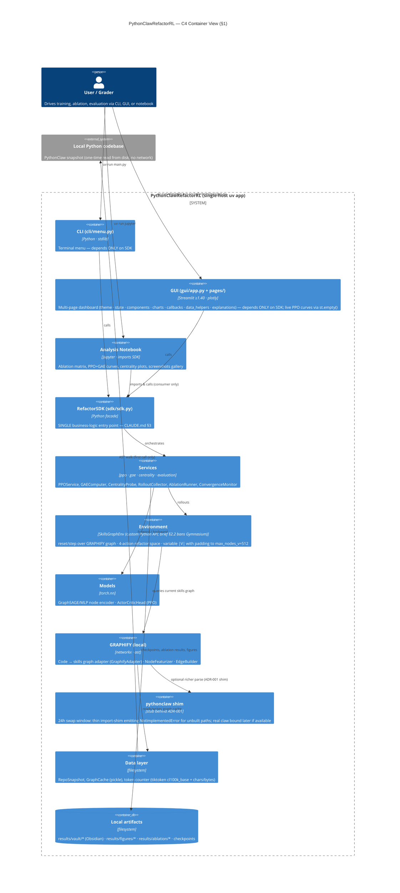
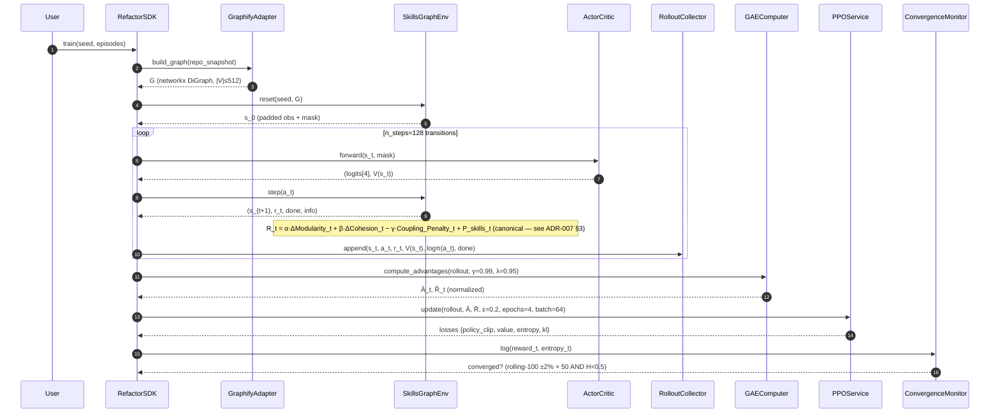
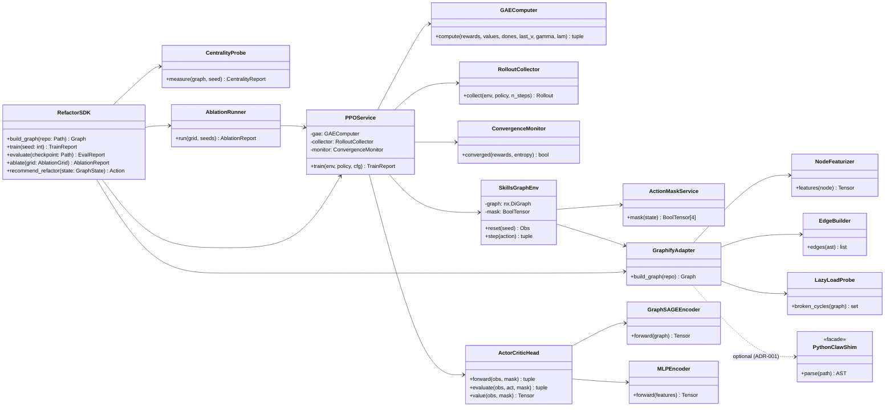

# PLAN — architecture & design (PythonClawRefactorRL)

Design/architecture doc (§2.2) for Assignment 4 — *PPO + GAE over a
GRAPHIFY skills-graph refactor environment* with a `pythonclaw` shim
behind ADR-001. Single source-of-truth aggregating layering, ADRs,
interface contracts, the parallel-processing decision, and the 4-phase
build sequence. Mirrors A3's PLAN structure so grader audit transfers.

> **Scope note (honesty).** Refactor-as-RL over a synthetic skills
> graph induced from one mid-sized Python codebase (the PythonClaw
> repo) — not a population study. Four caveats: GRAPHIFY is a local
> re-impl behind an adapter, not a port; lazy-load-broken is over-
> approximated by a dependency-cycle proxy; reward weights α/β/γ are
> calibrated, not derived; SB3 buffer assumes fixed |V|, handled via
> padding/masking per ADR-008.

## §1 — Architecture (C4-Container, mermaid)

> **Gymnasium ban (brief §2.2).** Brief §2.2 mandates: NO gymnasium
> import in `src/env/`. Enforced by
> `tests/architecture/test_env_no_gym.py` (AST-level check, not grep).
> `SkillsGraphEnv` exposes a custom Python `reset/step` API; any future
> parallelism uses a custom multiprocess wrapper (or single-process per
> ADR-007), never `gymnasium.vector.AsyncVectorEnv`.

**Context.** One user (or grader) drives PythonClawRefactorRL; the
only external system is a local Python codebase snapshot that GRAPHIFY
ingests. No network, no DB, no inference server, no auth surface.

**Containers / layers** (External → SDK → Services → Domain → Infrastructure):



**Dependency rule.** Arrows point downward only — a UI/notebook never
imports an engine module; the SDK is the seam (CLAUDE.md §3). The
`pythonclaw_shim` package is the *only* place that ever names
`pythonclaw` so a 24h swap to a real implementation needs no consumer
edits (ADR-001).

**Action space.** Discrete, cardinality **4**:
`{ 0:MoveSymbol, 1:ExtractFunction, 2:InlineSymbol, 3:NoOp }`.
Variable-|V| graphs are padded to `max_nodes_v=512` with a boolean mask
(ADR-008) so the SB3 fixed-shape rollout buffer stays valid.

## §2 — Component responsibilities

| Layer | Modules (under `src/refactorrl/`) | Responsibility | Forbidden |
|---|---|---|---|
| **data** | `data/repo_snapshot.py`, `data/graph_cache.py`, `data/token_counter.py` | One-time AST walk of the target repo; pickle cache of the induced graph; tiktoken cl100k_base headline + chars/bytes appendix (ADR-003) | No torch, no RL logic |
| **graphify** | `graphify/adapter.py`, `graphify/featurizer.py`, `graphify/edge_builder.py`, `graphify/lazy_load_probe.py` | Local re-impl of the GRAPHIFY contract behind `GraphifyAdapter` (ADR-002); node features (LOC, fan-in/out, imports, role); edge types (call, import, inherit); `lazy_load_probe` over-approximates §"lazy-load-broken" via dependency-cycle detection (ADR-005) | No env stepping; no model code |
| **pythonclaw_shim** | `pythonclaw_shim/__init__.py`, `pythonclaw_shim/contract.py` | Thin import-shim that exposes the names a "real" `pythonclaw` would; raises `NotImplementedError` for unbuilt paths so the 24h swap window is a one-PR change (ADR-001) | Any business logic — must remain a façade |
| **env** | `env/skills_graph_env.py`, `env/reward.py`, `env/action_mask.py`, `env/padding.py` | Custom Python `reset/step` API over the skills graph (brief §2.2 bans Gymnasium); canonical reward `R_t = α·ΔModularity_t + β·ΔCohesion_t − γ·Coupling_Penalty_t + P_skills_t` (ADR-007 §3); action-masking on inapplicable refactors; fixed-shape obs via padding to `max_nodes_v` (ADR-008) | No `gymnasium` import (AST-checked); no model training; no UI; no disk I/O on hot path |
| **model** | `model/graphsage_encoder.py`, `model/mlp_encoder.py`, `model/actor_critic_head.py` | `nn.Module` definitions only; GraphSAGE encoder is the headline (ADR-004), MLP-on-pooled-features is the ablation baseline; ActorCritic head emits `(logits[4], value)` | No env access; no training loop; no I/O |
| **services** | `services/ppo_service.py`, `services/gae_computer.py`, `services/rollout_collector.py`, `services/centrality_probe.py`, `services/convergence_monitor.py`, `services/ablation_runner.py`, `services/evaluator.py` | PPO clipped objective (ex04 §2.3, ε=0.2 FIXED); GAE(γ,λ) with λ=0.95 FIXED; centrality probe ≥5 seeds × exactly 2 calls/seed (start + end ONLY) (ADR-006); dual convergence criterion (rolling-100 reward ±2% × 50 episodes AND entropy<0.5); full α/β/γ + P_skills ablation matrix | No direct user I/O |
| **sdk** | `sdk/sdk.py`, `sdk/types.py` | Single façade — orchestrates services; the **only** import surface for UIs and the notebook; explicit dataclasses cross the boundary, never raw dicts | No training math inline; no `print()` |
| **cli** | `cli/menu.py`, `cli/__main__.py` | Numeric terminal menu; argparse entry | Imports anything below SDK |
| **gui** | `gui/app.py` (Streamlit entry), `gui/pages/` (one file per surface), `gui/theme.py` (Bar-Ilan `#003D7A` / `#FFCD00`), `gui/state.py` (namespaced `gui.<page>.<key>`), `gui/components.py`, `gui/charts.py` (plotly + matplotlib factories, DPI=110), `gui/callbacks.py` (observer hooks for live PPO charts), `gui/data_helpers.py` (`@st.cache_data` SDK wrappers), `gui/explanations.py` (LaTeX blurbs for PPO clip + GAE) | **Direct imports of `env`, `model`, `services`** — all logic via SDK; no inline `plt.*` outside `charts.py`; no un-namespaced `st.session_state` keys |
| **utils** | `utils/seeding.py`, `utils/io.py` | Deterministic seeding (random, numpy, torch CPU+CUDA, `PYTHONHASHSEED`, cuDNN flags); atomic checkpoint writes | No business logic |
| **notebook** | `notebooks/analysis.ipynb` | Ablation matrix, PPO+GAE curves, centrality plots, Obsidian hero shots as a *consumer* of the SDK; LaTeX cells next to plots | Re-implementing engine logic |

Every `src/**/*.py` ≤ **150 code lines** (CLAUDE.md §1). DRY-shared
helpers live in `services/_shared.py` / `model/_blocks.py`.

## §3 — Data flow (training step, mermaid sequence)



Centrality is measured *out-of-band*: per seed × ≥5 seeds, **exactly 2
calls/seed (start + end ONLY — no third "final-eval" call)** — never on
the hot rollout path (ADR-006). Variable-|V| is handled by padding
inside `env/padding.py` before the rollout buffer ever sees the obs, so
SB3's fixed-shape assumption holds (ADR-008).

## §4 — Hyperparameter tree

Every algorithm-relevant knob lives in `config/config.yaml`
(CLAUDE.md §4). Local UI styling (plotly DPI, button px) stays in its
rendering module. Tree shape:

```yaml
# config/config.yaml (authoritative — excerpt; see file for full)
version: "1.2.0"

ppo:
  clip_eps: 0.2          # FIXED by ex04 §2.3 — asserted in tests
  n_steps: 128
  batch_size: 64
  n_epochs: 4
  learning_rate: 3.0e-4
  vf_coef: 0.5
  ent_coef: 0.01
  max_grad_norm: 0.5

gae:
  lambda: 0.95           # FIXED by ex04 §2.3 — asserted in tests
  gamma: 0.99

reward:                  # MUST per locked decisions — full ablation
  alpha: 1.0             # ΔModularity weight
  beta: 1.0              # ΔCohesion weight
  gamma: 0.5             # Coupling penalty
  p_skills: -5.0         # lazy-load-break penalty (BIG NEGATIVE)

centrality:
  betweenness_calls_per_seed: 2   # exactly 2: start + end ONLY (ADR-006)

seeds: [42, 7, 123, 314, 271]     # ≥5 for statistical claims

training:
  max_episodes: 500
  convergence:
    rolling_window: 100
    reward_drift_pct: 2.0
    consecutive_episodes: 50
    entropy_threshold: 0.5

environment:
  max_nodes_v: 512        # padding cap for variable-|V| handling (ADR-008)

paths:
  vault_dir: "results/vault/"
  figures_dir: "results/figures/"
  ablation_dir: "results/ablation/"
```

**FIXED constants** (`ppo.clip_eps`, `gae.lambda`) are asserted in
`tests/test_ppo_constants.py` — tuning them fails CI. **Calibrated**
constants (reward weights, ent_coef, lr) sweep across the ablation
matrix (≥5 seeds/cell, mean ± std + 95% CI).

## §5 — PPO + GAE training loop sketch

Pseudocode below is the contract `services/ppo_service.py` +
`services/gae_computer.py` jointly satisfy. Loss math pins to ex04 §2.3
and is unit-tested in `tests/test_ppo_loss_formula.py`.

```python
# services/ppo_service.py (sketch — real file ≤150 LOC)
def train(env, policy, cfg, seeds):
    for seed in seeds:                                # ≥5 (ADR-006)
        set_global_seed(seed)
        for episode in range(cfg.training.max_episodes):
            rollout = collector.collect(env, policy, n_steps=cfg.ppo.n_steps)
            with torch.no_grad():
                last_v = policy.value(rollout.last_obs, rollout.last_mask)
            adv, ret = gae.compute(                   # GAE(γ=0.99, λ=0.95) FIXED
                rewards=rollout.rewards,
                values=rollout.values,
                dones=rollout.dones,
                last_value=last_v,
                gamma=cfg.gae.gamma,
                lam=cfg.gae.lambda,
            )
            adv = (adv - adv.mean()) / (adv.std() + 1e-8)   # advantage norm
            for _ in range(cfg.ppo.n_epochs):               # 4 epochs FIXED
                for batch in minibatches(rollout, cfg.ppo.batch_size):
                    logp, entropy, value = policy.evaluate(batch.obs, batch.act, batch.mask)
                    ratio = torch.exp(logp - batch.old_logp)
                    surr1 = ratio * batch.adv
                    surr2 = torch.clamp(ratio, 1 - cfg.ppo.clip_eps,
                                               1 + cfg.ppo.clip_eps) * batch.adv
                    pol_loss = -torch.min(surr1, surr2).mean()        # ε=0.2 FIXED
                    val_loss = F.mse_loss(value, batch.ret)
                    ent_bonus = entropy.mean()
                    loss = (pol_loss
                            + cfg.ppo.vf_coef * val_loss
                            - cfg.ppo.ent_coef * ent_bonus)
                    optimizer.zero_grad()
                    loss.backward()
                    nn.utils.clip_grad_norm_(policy.parameters(),
                                             cfg.ppo.max_grad_norm)
                    optimizer.step()
            if monitor.converged(rollout.episode_rewards, entropy_bonus=ent_bonus):
                break                                  # dual criterion (locked decision)
```

Key invariants tested in `tests/`:
- `test_gae_formula.py` — closed-form check on a 4-step toy trajectory.
- `test_ppo_clip_invariant.py` — when ratio is inside `[1−ε, 1+ε]`, gradient equals the unclipped surrogate gradient.
- `test_advantage_normalization.py` — post-norm advantage has mean ≈ 0, std ≈ 1.
- `test_convergence_dual_criterion.py` — neither criterion alone triggers a "converged" verdict.

## §6 — Parallel processing scope (single-process choice + rationale)

**Single-process, single-threaded by design**, same call as A3 because
the cost profile is identical in shape (CPU-bound forward/backward +
trivial I/O):

- Cost centres are **PPO forward/backward** (2–3-layer GraphSAGE or
  MLP on ≤512 nodes) and **GAE accumulation** (single backward scan
  over `n_steps=128`). Both CPU-bound; GIL does not bind.
- I/O is trivial: GRAPHIFY runs once per seed (cached pickle);
  centrality exactly 2 calls/seed (start + end ONLY, ADR-006). No
  worker pool warranted.
- Vector envs help only if `env.step` is the bottleneck; profile target
  is `<5 ms/step` at |V|=512 — forward/backward dominates by 10×.
- Reproducibility (per ADR-006) is materially harder under
  multiprocessing — per-worker seeding + cuDNN-deterministic flags
  become joint failure modes. We pay the single-process tax.

**State assumptions.** `SkillsGraphEnv` holds the current graph + edit
history (reset rebuilds from cached `GraphifyAdapter`); not
thread-safe — concurrent rollouts would need one env per worker.
`RolloutCollector` uses fixed-size tensors `[n_steps, ...]`; no replay
buffer. Checkpoints written atomically (`*.pt.tmp` → rename).

Upgrade path if env-step becomes the bottleneck: a **custom
multiprocess wrapper** (or single-process per ADR-007) *behind the SDK
boundary* — consumers do not change. Brief §2.2 bans `gymnasium`, so
`gymnasium.vector.AsyncVectorEnv` is explicitly NOT on the table.
Recorded as ADR-010 re-open trigger.

## §7 — 4-phase roadmap with deliverables per phase

Sequenced phase-milestones; each phase is a single TDD commit
(RED → GREEN → REFACTOR) on branch `assignment-4`. Commit subject regex
`^(Phase \d+|Phase 0 bootstrap|chore: bootstrap)` enforced locally.

| # | Phase | Deliverables | Tests gating the phase |
|---|---|---|---|
| **0** | **Bootstrap** (already underway) | `pyproject.toml`, `config/config.yaml`, `pythonclaw_shim/` skeleton, ADR-001…009 stubs, ruff + uv green | `test_bootstrap_smoke.py` (import every package), `test_ppo_constants.py` (FIXED constants present) |
| **1** | **GRAPHIFY adapter + repo ingest** | `GraphifyAdapter.build_graph(repo_path) → nx.DiGraph`; `NodeFeaturizer` (LOC, fan-in/out, role); `EdgeBuilder` (call, import, inherit); `lazy_load_probe` cycle detector; tiktoken token-count headline; graph cache pickle | `test_graphify_adapter.py`, `test_node_features.py`, `test_edge_types.py`, `test_lazy_load_probe.py` (broken-cycle detected), `test_token_count_headline.py` (cl100k_base + chars/bytes appendix) |
| **2** | **Env + reward + masking + padding** | `SkillsGraphEnv.reset/step` (custom Python API — brief §2.2 bans Gymnasium); canonical reward `R_t = α·ΔModularity_t + β·ΔCohesion_t − γ·Coupling_Penalty_t + P_skills_t` (ADR-007 §3); `ActionMaskService`; padding to `max_nodes_v=512` (ADR-008 fallback — primary path is variable-|V| PyG DataLoader per ADR-004) | `tests/architecture/test_env_no_gym.py` (AST-level — no `gymnasium` import in `src/env/`), `test_env_step_shapes.py`, `test_reward_signs.py` (each term flips reward in the expected direction; `P_skills` is NEGATIVE), `test_action_mask.py` (masked → prob 0 post-softmax), `test_padding_invariance.py` (policy output equals dense path for unmasked nodes) |
| **3** | **PPO + GAE service + convergence + centrality probe** | `GAEComputer.compute(γ,λ)`; `PPOService.train(seeds)`; `ConvergenceMonitor` (dual criterion); `CentralityProbe` (≥5 seeds, exactly 2 calls/seed — start + end ONLY); `RolloutCollector` | `test_gae_formula.py`, `test_ppo_clip_invariant.py`, `test_advantage_normalization.py`, `test_convergence_dual_criterion.py`, `test_centrality_discipline.py` (call-count cap enforced) |
| **4** | **SDK facade + CLI + GUI + notebook + ablation matrix + screenshots + §2.4 essay + skills theory + learning curves + cost envelope** | `RefactorSDK.{build_graph, train, evaluate, ablate, recommend_refactor}`; `cli/menu.py`; `gui/` Streamlit dashboard; `notebooks/analysis.ipynb`; full α/β/γ + P_skills ablation matrix (≥5 seeds/cell); programmatic NetworkX/pyvis screenshots + Obsidian hero shots; `docs/essay_2_4.md` (2500–3000 words, 4 sections, 8–12 citations, 2 diagrams); **F15** `docs/SKILLS_ARCHITECTURE.md` (L1/L2/L3 theoretical deep-dive + ≥2 concrete usage examples, brief §2.1 mandate); **D6** `results/learning_curves/reward_vs_episode.png` (mean ± 95% CI over ≥5 seeds); **D7** ΔReward (final − initial mean ± std + 95% CI) in `docs/ANALYSIS.md`; **D8** cost envelope in `docs/COST_ANALYSIS.md` | `test_sdk_smoke.py`, `test_cli_menu.py`, `test_gui_foundation.py`, `test_notebook_runs_nbclient.py`, `test_ablation_matrix_complete.py`, `test_screenshots_exist.py`, **F16** `tests/test_learning_curve.py` (asserts reward-over-training PNG exists + ΔReward numeric reported) |

**Definition of Done (per phase)** — PRD approved, TDD commit landed,
ruff zero, ≤150 LOC/file, coverage ≥85%, ADR updated if architecture
shifted, `docs/shared/PROMPTS.md` records the literal prompt used.

## §8 — ADR registry (11 ADRs)

ADRs live in `docs/adr/` and follow *Context → Decision → Consequences*.
Ten already drafted in bootstrap (ADR-001…010); ADR-011 (SkillsAdapter
boundary) is added in the Phase-0 fix bundle alongside the ADR-001
canonical-reward edit. See ADR-007 §3 for the canonical reward equation
and config keys.

| ADR | Title | Why it matters |
|---|---|---|
| **ADR-001** | PythonClaw shim boundary (24h swap window) | Keeps the `pythonclaw` dependency name in exactly one package so a real implementation drop-in is a 1-PR change; consumers import the shim, never the upstream name. |
| **ADR-002** | GraphifyAdapter — local re-impl behind adapter | The external GRAPHIFY contract is unstable; we re-implement the minimal surface we need (`build_graph` + `NodeFeaturizer` + `EdgeBuilder`) behind a port, so a future port to the real tool is a single-file swap. |
| **ADR-003** | Tiktoken cl100k_base as headline cost metric (+ chars/bytes appendix) | Lecturer-grader-readable token count; cl100k_base is the de-facto LLM cost basis; chars/bytes kept as appendix so cl100k drift over time does not invalidate historical figures. |
| **ADR-004** | GraphSAGE vs MLP encoder | GraphSAGE is the headline (uses graph structure); MLP-on-pooled-features is the ablation baseline; lets us isolate the value of message passing. |
| **ADR-005** | Lazy-load-broken semantics via cycle detection | Honest over-approximation of the §"lazy-load-broken" signal; documented limitation: detects *necessary* but not *sufficient* break conditions. |
| **ADR-006** | Multi-seed eval discipline (≥5 seeds; centrality exactly 2 calls/seed — start + end ONLY, no third "final-eval" call) | Forces statistical honesty (mean ± std + 95% CI) and bounds centrality cost (betweenness is O(VE)). |
| **ADR-007** | Canonical reward equation (brief §2.2 verbatim): `R_t = α·ΔModularity_t + β·ΔCohesion_t − γ·Coupling_Penalty_t + P_skills_t` with α=1.0, β=1.0, γ=0.5, P_skills=−5.0 | Pins the reward shape to a defensible refactor-quality decomposition; `P_skills` is a NEGATIVE penalty on lazy-load-break (no positive `skills_bonus`); full α/β/γ + P_skills ablation matrix proves each term matters. **See ADR-007 §3 for canonical equation + `config/config.yaml` keys.** |
| **ADR-008** | Variable-|V| handling: padding to `max_nodes_v=512` is a CONDITIONAL fallback (only if SB3 RolloutBuffer cannot handle Dict obs); primary path is variable-|V| via PyG DataLoader per ADR-004 | Spike-gated; STATE_DESIGN and ADR-008 status reconciled (both "spike-gated"). |
| **ADR-009** | Screenshot pipeline (programmatic NetworkX/pyvis + Obsidian hero shots) | Deterministic, reproducible screenshots — no manual capture; each figure regenerable from `uv run scripts/render_figures.py`. |
| **ADR-010** | Single-process training; vector-env upgrade deferred (re-open if env-step >1ms) | Documents §6: reproducibility budget beats throughput at our scale; upgrade path is a **custom multiprocess wrapper** through the SDK boundary (brief §2.2 bans `gymnasium`, so AsyncVectorEnv is off the table). |
| **ADR-011** | SkillsAdapter boundary (new — added in Phase-0 fix bundle) | Pins the skills-injection seam separate from the `pythonclaw` shim (ADR-001) so L1/L2/L3 skill levels (per F15 `docs/SKILLS_ARCHITECTURE.md`) are swap-in via a stable Protocol; lazy-load-break monitor wires through this boundary. |

## §9 — OOP layer diagram



**Inheritance discipline.** `GraphSAGEEncoder` and `MLPEncoder` both
implement a common `NodeEncoder` protocol (`forward(graph) → Tensor`)
so `ActorCriticHead` is encoder-agnostic — the ablation between them is
a single-line config swap, not a code edit. Shared loss/clip math
lives in `services/_shared.py` so `PPOService` and any future PPG/TRPO
sibling reuse it (DRY, CLAUDE.md §5). The SDK is the only public
import surface; every other module name is internal.
