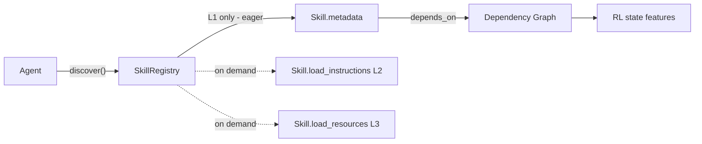
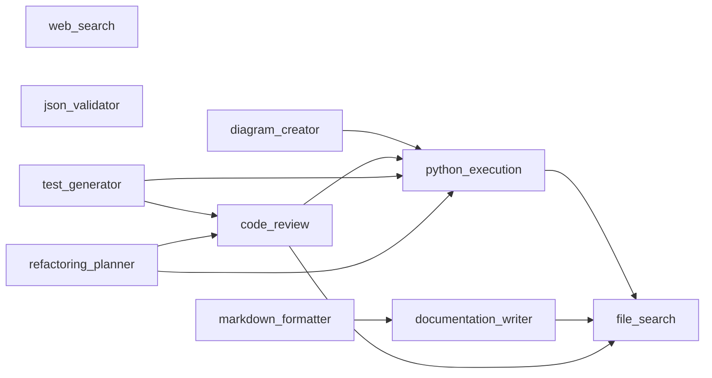

# Skills Architecture

> Deep-dive companion to the brief §2.1 mandate (F15 deliverable).
> See also: `docs/prd/PRD-SKILLS.md`, `docs/adr/ADR-001-pythonclaw-shim-boundary.md`,
> `docs/adr/ADR-005-lazy-load-broken-semantics.md`, `docs/adr/ADR-011-skills-adapter.md`.

---

## 1. Overview

PythonClaw **Skills** are AI-agent skill modules that bundle the
prompt-engineering, knowledge, and runtime hints an LLM agent needs to
perform one well-scoped task (e.g. "review a Python diff", "search files",
"generate pytest cases"). Each skill is split into three on-disk layers
that are loaded **lazily** — only the bytes the caller actually needs are
materialised in the prompt window.

| Layer | Name          | Purpose                                                    | Typical size |
|-------|---------------|------------------------------------------------------------|--------------|
| **L1** | Metadata     | name, version, description, dependencies, token estimates   | ~50 tokens   |
| **L2** | Instructions | system prompt, few-shot templates, invocation patterns      | ~500 tokens  |
| **L3** | Resources    | knowledge base, cookbooks, large templates, configs         | ~5000 tokens |

The on-disk layout (one of ten sample skills shown):

```
src/pythonclaw_shim/sample_skills/
├── code_review.metadata.json      # L1
├── code_review.instructions.json  # L2
├── code_review.resources.json     # L3
└── ...
```

The contract that surfaces these layers is `SkillsAdapter` (ADR-011):

```python
class Skill(Protocol):
    name: str
    version: str
    metadata: dict           # L1 — always loaded
    def load_instructions(self) -> dict: ...   # L2 — on demand
    def load_resources(self) -> dict: ...      # L3 — on demand
    def estimated_tokens(self, layer: str) -> int: ...

class SkillRegistry(Protocol):
    def discover(self) -> list[Skill]: ...     # scans sample_skills/
    def get(self, skill_id: str) -> Skill: ...
    def load_metadata(self, skill_id: str) -> dict: ...
    def load_instructions(self, skill_id: str) -> dict: ...
    def load_resources(self, skill_id: str) -> dict: ...
```

---

## 2. Why lazy loading?

Three reasons, in priority order:

1. **Token-cost discipline.** Planning needs only L1 (≈ 50 tok × N skills).
   A 10-skill catalog costs ~500 tokens at planning time; eagerly loading
   L2+L3 for the same catalog would cost ~55 000 tokens — a 110× blow-up
   the agent rarely needs to pay.
2. **Caching.** Most skill calls only touch L1 (the planner asks
   "which skills are even relevant?"). L2 is paid once per *active* skill
   per episode; L3 is paid only when a skill genuinely needs its reference
   material.
3. **Cross-skill graph traversal can run on L1 alone.** Dependency
   resolution, topological ordering, and our modularity/cohesion features
   for the RL state are all computable from `depends_on` in L1 — no need
   to touch L2 or L3 during graph analysis.

The lazy semantics are **enforced** (ADR-005): touching `skill.metadata`
**must not** trigger L2 or L3 loads. Tests in `tests/skills/` assert this
by counting file I/O calls.

---

## 3. Architecture diagram



Solid arrows are the eager path (always paid). Dotted arrows are lazy
loads paid only when an action requires them.

---

## 4. Worked example 1 — `file_search`

**L1 — `file_search.metadata.json`**

```json
{
  "name": "file_search",
  "version": "1.0.0",
  "description": "Searches the local filesystem by path glob and content regex.",
  "estimated_tokens": {"L1": 50, "L2": 500, "L3": 5000},
  "tags": ["search", "filesystem", "regex"],
  "depends_on": []
}
```

**L2 — `file_search.instructions.json`** (excerpt)

System prompt + ripgrep invocation patterns: how to pick `--type`,
when to escape regex metachars, how to paginate large result sets.
The agent only loads L2 once it has *chosen* to use `file_search`.

**L3 — `file_search.resources.json`** (excerpt)

A ~10-page cookbook of grep/ripgrep idioms — language-specific patterns,
common pitfalls, perf tips. Paid only when the agent's plan asks for a
deep recipe (e.g. "search across vendored third-party code").

**Lazy-load benefit.** When the planner is deciding whether `file_search`
is even a candidate, it sees only the 50 L1 tokens — not 5550.

---

## 5. Worked example 2 — `code_review`

**L1 — `code_review.metadata.json`**

```json
{
  "name": "code_review",
  "version": "1.0.0",
  "description": "Reviews Python diffs for correctness, style, and security issues.",
  "estimated_tokens": {"L1": 50, "L2": 500, "L3": 5000},
  "tags": ["review", "quality", "python"],
  "depends_on": ["python_execution", "file_search"]
}
```

**L2 — `code_review.instructions.json`** (excerpt)

The reviewer's checklist (correctness → security → style → perf),
references to the project style guide, and a few-shot template showing
how to format findings.

**L3 — `code_review.resources.json`** (excerpt)

A ~50-page rubric plus 30 example reviews covering edge cases:
async correctness, generator lifetime bugs, supply-chain hazards,
type-narrowing pitfalls. Large, expensive, *rarely needed* — only paid
when a reviewer agent is actually instantiated.

**Lazy-load benefit.** A planning agent that lists `code_review` as a
candidate never pays for L3 unless `code_review` is *selected* for the
turn. In a typical episode it never is.

---

## 6. The dependency graph

The 10-skill catalog under `src/pythonclaw_shim/sample_skills/` declares
its edges via `depends_on` in L1. The full graph:



Three sinks (`file_search`, `web_search`, `json_validator`) have no
dependencies and act as leaves. `refactoring_planner` is the deepest
node — it transitively requires `code_review`, `python_execution`,
and `file_search`.

This DAG is exactly the substrate the RL agent edits: each PPO action
proposes a change to either the **edge set** (move/split/merge skills)
or the **layer split** (rebalance L1↔L2↔L3). The reward sees only the
resulting graph statistics — it never inspects L2 or L3 content.

---

## 7. Why this matters for the RL refactor

The brief §2.2 mandate is to **learn** a refactoring policy on this
graph. The skills architecture is what makes the reward well-defined:

- **ΔModularity (α = 1.0).** Computed from the L1 edge set — the agent is
  rewarded for partitioning skills into cohesive clusters with sparse
  inter-cluster edges.
- **ΔCohesion (β = 1.0).** Computed from intra-cluster edge density,
  again over L1 only.
- **Coupling penalty (γ = 0.5).** Subtracts a function of cross-cluster
  edges — discourages spaghetti dependencies.
- **P_skills_t = −5.0 (config key: `reward.p_skills`).** Fires
  **negatively** whenever an action would break lazy-load semantics
  (e.g. inlining L3 into L1, removing a `depends_on` that L2 actually
  needs). This is the architectural guardrail expressed as a reward
  signal.

> **Reward:** `R_t = α·ΔModularity + β·ΔCohesion − γ·Coupling_Penalty + P_skills_t`
> with `α=1.0, β=1.0, γ=0.5, P_skills=−5.0`.

The crucial design point: because the RL features live on **L1 only**,
training cost is proportional to the *number of skills*, not to the
*size of their bodies*. A catalog with hundred-page L3 cookbooks costs
the same to train as one with empty L3 files. That separation — graph
in L1, content in L2/L3, lazy bridges between them — is what makes the
brief §2.2 setup tractable.

---

## 8. References

- **PRD-SKILLS** (`docs/prd/PRD-SKILLS.md`) — product requirements for
  the skills subsystem.
- **ADR-001** (`docs/adr/ADR-001-pythonclaw-shim-boundary.md`) — the
  shim boundary that keeps real Claude Code skills out of the RL loop.
- **ADR-005** (`docs/adr/ADR-005-lazy-load-broken-semantics.md`) — the
  formal statement of the lazy-load invariant the P_skills penalty
  defends.
- **ADR-011** (`docs/adr/ADR-011-skills-adapter.md`) — the
  `Skill` / `SkillRegistry` protocol contract summarised in §1.
- **Brief §2.1** — mandates this deep-dive plus the ≥2 worked examples
  in §4 and §5.
- **Brief §2.2** — bans `gymnasium` under `src/env/` and `src/services/`
  and defines the RL substrate that operates on the L1 graph above.
