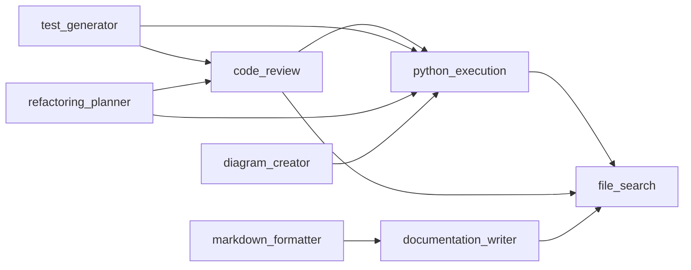

# sample_skills

Fixture corpus of 10 AI-agent skills used by the PythonClaw shim
to exercise the SkillsAdapter (ADR-011) and lazy-load (ADR-005).
Each skill is three JSON files split by layer:

- `{id}.metadata.json` — L1 (small, always loaded)
- `{id}.instructions.json` — L2 (medium, loaded on demand)
- `{id}.resources.json` — L3 (large, loaded on demand)

Per-layer estimates: `{L1: 50, L2: 500, L3: 5000}`. Accessing
`skill.metadata` must NOT load L2 or L3.

## Skills

`code_review`, `diagram_creator`, `documentation_writer`,
`file_search`, `json_validator`, `markdown_formatter`,
`python_execution`, `refactoring_planner`, `test_generator`,
`web_search`.

## Dependency graph

Roots: `web_search`, `file_search`, `json_validator`.
Leaves: `test_generator`, `refactoring_planner`,
`diagram_creator`, `markdown_formatter`.
